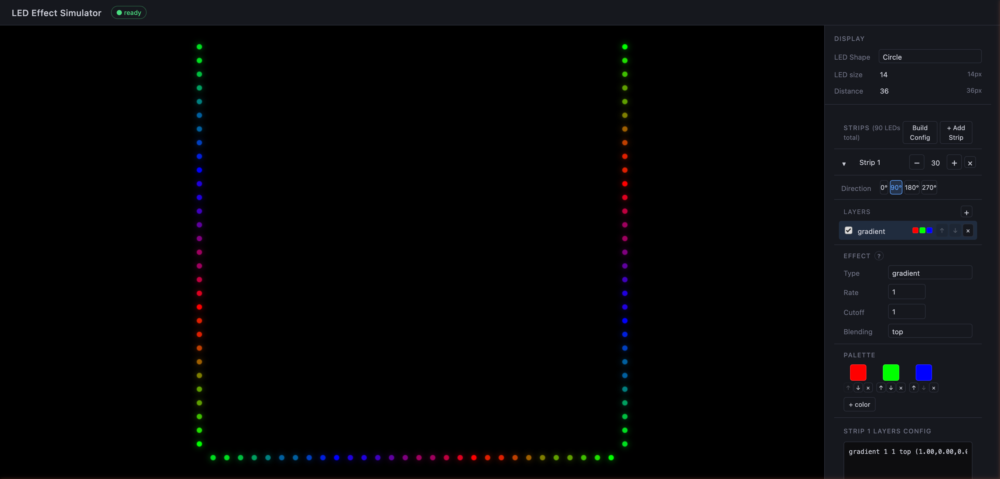

# klipper-led_effect Simulator

A browser-based simulator for [klipper-led_effect](https://github.com/julianschill/klipper-led_effect) by Julian Schill. Design and preview LED effects for your Klipper 3D printer — no printer required.

**[Try it live →](https://rdrcrmatt.github.io/klipper-led_effect_simulator/)**



The simulation engine runs entirely in the browser via [Pyodide](https://pyodide.org) (Python compiled to WebAssembly), so no server or local installation is needed.

---

## Features

- **Exact engine fidelity** — runs the real `led_effect.py` engine via Pyodide, so what you see matches what your printer will do
- **Multiple LED strips** — add as many strips as your setup has; each has independent layers, LED count, and direction
- **Live layer editing** — add, reorder, and configure effect layers with an instant preview
- **All built-in effects** — static, breathing, gradient, comet, chase, cylon, blink, strobe, twinkle, fire, heater, temperature, stepper, progress, and more
- **Printer state simulation** — adjust stepper position, heater temp, print progress, and analog value to preview reactive effects
- **Klipper config builder** — generates ready-to-paste `[led_effect]` and `[gcode_macro]` config blocks; strips with identical layers are automatically grouped into one effect with comma-separated LED ranges
- **Import / export** — copy and paste layer configs between strips or from your existing klipper config
- **No install required** — runs in any modern browser

---

## Usage

### Hosted (no setup)

> GitHub Pages link coming soon — see [Setting up GitHub Pages](#setting-up-github-pages) below.

### Local development

**Frontend only (Pyodide — recommended):**

```bash
cd frontend
npm install
npm run dev
```

Open `http://localhost:5173`. Pyodide (~10 MB) loads from CDN on first visit; subsequent loads use the browser cache.

**With Python backend (optional, for backend development):**

```bash
# Terminal 1 — backend
cd backend
python -m venv venv
source venv/bin/activate
pip install -r requirements.txt
uvicorn main:app --host 0.0.0.0 --port 8000 --reload

# Terminal 2 — frontend (proxy mode)
cd frontend
npm install
npm run dev
```

The Vite dev server proxies `/ws` to the backend when configured. To re-enable the proxy, add it back to `vite.config.ts`.

---

## Configuring effects

Each strip has a **Layers Config** text box that uses the same syntax as klipper-led_effect's `layers:` section:

```
effect_type  rate  cutoff  blending_mode  (r,g,b),(r,g,b),...
```

**Examples:**

```
# Slow red-to-green gradient scrolling across the strip
gradient 1 1 top (1,0,0),(0,1,0)

# Rainbow barf (Stealthburner style)
gradient 1 1 top (1,0,0),(1,0.5,0),(1,1,0),(0,1,0),(0,0,1),(0.5,0,1)

# Breathing white on top of a static dim blue
breathing 1 1 add (1,1,1)
static    0 0 top (0,0,0.2)
```

You can paste configs directly from your printer's `printer.cfg` and they will load immediately.

---

## Building for production

```bash
cd frontend
npm run build
```

Output is in `frontend/dist/`. The `base: './'` setting in `vite.config.ts` makes all asset paths relative, so the built files work when served from any subdirectory (including GitHub Pages).

---

## Setting up GitHub Pages

1. Go to your repo → **Settings** → **Pages**
2. Under **Source**, select **GitHub Actions**
3. Create `.github/workflows/deploy.yml`:

```yaml
name: Deploy to GitHub Pages

on:
  push:
    branches: [main]

jobs:
  build-and-deploy:
    runs-on: ubuntu-latest
    permissions:
      contents: read
      pages: write
      id-token: write
    environment:
      name: github-pages
      url: ${{ steps.deploy.outputs.page_url }}
    steps:
      - uses: actions/checkout@v4
      - uses: actions/setup-node@v4
        with:
          node-version: 20
          cache: npm
          cache-dependency-path: frontend/package-lock.json
      - run: npm ci
        working-directory: frontend
      - run: npm run build
        working-directory: frontend
      - uses: actions/upload-pages-artifact@v3
        with:
          path: frontend/dist
      - uses: actions/deploy-pages@v4
        id: deploy
```

---

## Project structure

```
klipper-led_effect_simulator/
├── backend/                   # FastAPI WebSocket backend (optional)
│   ├── main.py                # WebSocket server + session management
│   ├── led_effect.py          # klipper-led_effect engine (upstream)
│   ├── klippermock.py         # Klipper API mock layer
│   └── requirements.txt
└── frontend/                  # React + TypeScript + Vite
    └── src/
        ├── py/
        │   ├── led_effect.py  # Engine (copy of backend, loaded by Pyodide)
        │   └── klippermock.py # Mock layer (copy of backend, loaded by Pyodide)
        ├── worker/
        │   └── simulator.worker.ts   # Web Worker: Pyodide + frame loop
        ├── hooks/
        │   └── useSimulator.ts       # React hook wrapping the worker
        ├── components/
        │   ├── SimControls.tsx        # Sidebar: strips, display, printer state
        │   ├── StripPanel.tsx         # Accordion for each LED strip
        │   ├── LayerEditor.tsx        # Layer list editor
        │   ├── MacroBuilderModal.tsx  # Klipper config generator
        │   ├── ConfigPanel.tsx        # Import/export layers text
        │   ├── HelpModal.tsx          # Effect reference
        │   └── LedCanvas.tsx          # Canvas renderer
        └── utils/
            ├── layerConfig.ts   # Layer parse/serialize
            └── ledLayout.ts     # LED coordinate layout
```

---

## Credits

- **[klipper-led_effect](https://github.com/julianschill/klipper-led_effect)** by Julian Schill — the LED effect engine this simulator is built around
- **[Pyodide](https://pyodide.org)** — Python/WASM runtime that makes browser-side simulation possible
